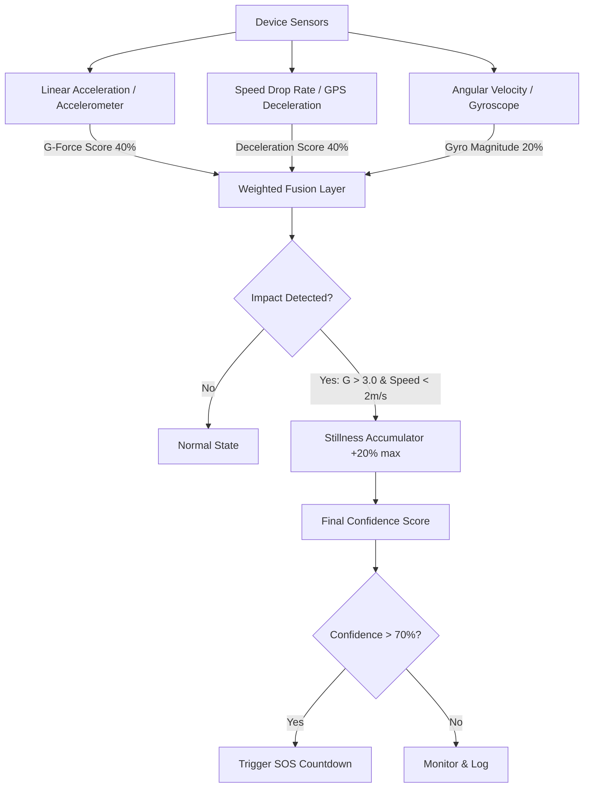

# roadSoS - Premium AI Road Safety & Accident Detection

A premium dark-themed Flutter application integrated with intelligent crash detection algorithms that utilize device sensors (accelerometer, gyroscope, GPS) to automatically detect road accidents, trigger emergency countdowns, alert dispatch services, and notify family members.

## 🌟 Application Features & Converted UI Screens

### 📱 Premium Frontend UI
- **SplashScreen & LoginScreen (`splash_screen.dart`, `login_screen.dart`)**: Sleek dark authentication flow with smooth typography, customized glassmorphic card elements, and high-fidelity inputs.
- **MainLayout (`main_layout.dart`)**: Modern layout housing a premium custom floating bottom navigation bar that links all main modules seamlessly.
- **HomeScreen (`home_screen.dart`)**: Features high-fidelity widgets displaying the real-time protection status, active monitoring mode, pulsing search dot, and quick emergency actions.
- **MapScreen (`map_screen.dart`)**: Shows nearby emergency hospitals, real-time safety scores, routing statistics, and nearest medical facility pins.
- **ChatScreen (`chat_screen.dart`)**: Integrated with **PRAANA AI**, featuring a simulated AI response system with typing indicators, audio input options, quick emergency replies, and dispatch updates.
- **ContactsScreen (`contacts_screen.dart`)**: Organizes instant national hotlines (Ambulance, Police, Fire) and interactive personal contact cards with custom action hooks.
- **ProfileScreen (`profile_screen.dart`)**: Houses user medical profile details (blood type, allergies, conditions, scan-at-ER QR code) and provides the gateway to the **Advanced Dashboard**.
- **SosActivationScreen (`sos_activation_screen.dart`)**: Displays a high-intensity red animated circular progress ring count-down and pulses real-time dispatch progress.
- **LiveTrackingScreen (`live_tracking_screen.dart`)**: An advanced interface visually tracing the ETA, unit identification, paramedic details, and active hospital pre-alert status.

### ⚙️ Original Hardware/Backend Service
- **Advanced Dashboard (`monitoring_screen.dart`)**: Accessible directly from the Profile page. It showcases your original crash-detection debugging suite, displaying real-time G-Force values, velocity charts, gyroscope rates, stillness logs, and live crash triggers.

---

## 🔬 Crash Detection Physics & Mathematics

The system utilizes a weighted **Multi-Sensor Fusion Algorithm** to evaluate the probability of a vehicle accident in real-time, mapping the fused result to a **Crash Confidence Score ($C$)** between `0.0` (0%) and `1.0` (100%). This prevents false positives caused by normal deceleration or dropping the device.



### 1. G-Force Calculation ($G_{score}$)
The linear accelerometer measures acceleration in proper G's ($1\text{ g} \approx 9.81\text{ m/s}^2$). 
- **Physics**: Accidental vehicle collisions create rapid changes in momentum, yielding high G-forces. The algorithm ignores minor bumps by establishing a baseline threshold of **$1.5\text{ g}$**. Forces are scaled up to a severe crash maximum target of **$6.5\text{ g}$** ($1.5\text{ g}$ baseline $+$ $5.0\text{ g}$ scaling delta).
- **Mathematical Formula**:
  $$G_{score} = \text{clamp}\left(0.0, \, \frac{G_{peak} - 1.5}{5.0}, \, 1.0\right)$$
- **Rolling Window**: Peak values ($G_{peak}$) are captured in a **5-second rolling window** to allow correlation with subsequent deceleration.

### 2. Speed Deceleration Calculation ($S_{score}$)
GPS speed values ($v$ in $\text{m/s}$) are tracked continuously over time ($t$).
- **Physics**: Deceleration ($a$) is the rate of change of velocity:
  $$a = \frac{\Delta v}{\Delta t}$$
  Normal heavy vehicle braking caps out around $3.0\text{ m/s}^2$ to $4.5\text{ m/s}^2$. Extreme collisions produce drastic deceleration forces. The algorithm scales deceleration up to an absolute crash threshold of **$10.0\text{ m/s}^2$**.
- **Mathematical Formula**:
  $$S_{score} = \text{clamp}\left(0.0, \, \frac{|a|}{10.0}, \, 1.0\right)$$

### 3. Rotational Velocity Calculation ($R_{score}$)
The gyroscope measures rotation around three axes in radians per second ($\text{rad/s}$).
- **Physics**: Rollover crashes or violent side-swipes induce heavy rotation. The magnitude of angular velocity ($\omega$) is calculated as:
  $$\omega = \sqrt{\omega_x^2 + \omega_y^2 + \omega_z^2}$$
  Rotations exceeding **$5.0\text{ rad/s}$** (approx. $286^\circ/\text{s}$) represent violent rotations.
- **Mathematical Formula**:
  $$R_{score} = \text{clamp}\left(0.0, \, \frac{\omega}{5.0}, \, 1.0\right)$$

### 4. Post-Crash Stillness Modifier ($Still_{score}$)
- **Physics**: If an impact occurs and the user is severely injured, the device becomes completely still. If the peak G-force exceeds **$3.0\text{ g}$** and the speed is below **$2.0\text{ m/s}$** ($\approx 7.2\text{ km/h}$), stillness accumulates:
  $$\Delta Still = +0.05 \text{ per second (max } 0.20\text{)}$$
  If movement resumes, it decays at $-0.01$ per second.

---

### 5. Multi-Sensor Weighted Fusion Formula
All sensor scores are fused to compute the final accident probability:

$$\text{Confidence } (C) = \text{clamp}\left(0.0, \, (G_{score} \times 0.4) + (S_{score} \times 0.4) + (R_{score} \times 0.2) + Still_{score}, \, 1.0\right)$$

#### False-Positive Mitigation Example:
- **Dropping the phone**: High G-force ($G_{score} \approx 0.8$), but speed deceleration is zero ($S_{score} = 0.0$), and rotation is brief. Fused confidence remains at $\approx 32\%$ — below the emergency threshold.
- **Extreme Braking**: High deceleration ($S_{score} \approx 0.4$), but G-force remains normal ($G_{score} = 0.0$), and rotation is zero. Fused confidence remains under $\approx 16\%$.
- **Real Collision**: High G-force ($0.8$), high deceleration ($0.8$), and rollover rotation ($0.5$). Fused confidence reaches $74\%$, boosted by stillness to $94\%$, triggering immediate emergency flow.

---

## 🛠️ Installation & Setup

1. **Prerequisites**: Ensure Flutter SDK and Git are installed on your machine.
2. **Clone & Open**:
   ```bash
   git clone <repository-url>
   cd roadSOS
   ```
3. **Get Dependencies**:
   ```bash
   flutter pub get
   ```
4. **Run Live Development Server**:
   ```bash
   flutter run -d web-server --web-port 54289 --web-hostname 0.0.0.0
   ```
